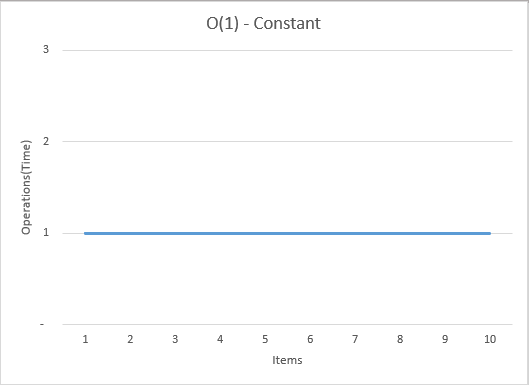
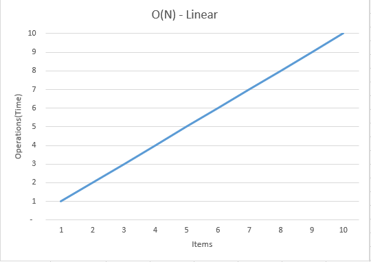

# 3-Simple-Big-O-Notation-For-Begginers-ELI5

## Notes
- Tries to explain how many opations, or how long it will take something to execute.
- How quickly this time grows.
- "N" is the size of the input.
- Usually here we are just worried about the worst case scenario. So if we are trying to find a value in our array, it MIGHT be in the first index, but it COULD be in the last and we have to iterate through every item to find it.

## The Basic Notations
- O(1) : Constant Time
  - Number of operations is the same regardless of the size of the input.
  - From [Examples.xlsx](Examples.xlsx): 

- O(N) : Linear Time
  - Number of operations is proportional to the size of the input.
  - From [Examples.xlsx](Examples.xlsx): 

- O(N^2) : Quadratic Time
  - Number of operations is the square of the number of inputs.
  - From [Examples.xlsx](Examples.xlsx): 

- O(log N) Logarithmic 
  - Number of operations peaks at the beginning and then flattens as the size of the input increases.
  - Binary Search Tree
  - From [Examples.xlsx](Examples.xlsx): 